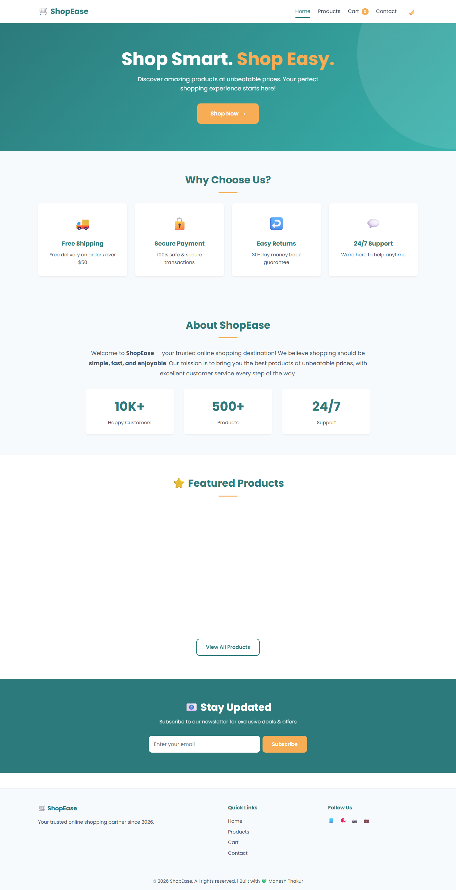
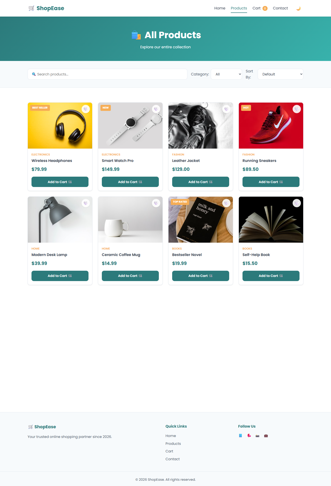
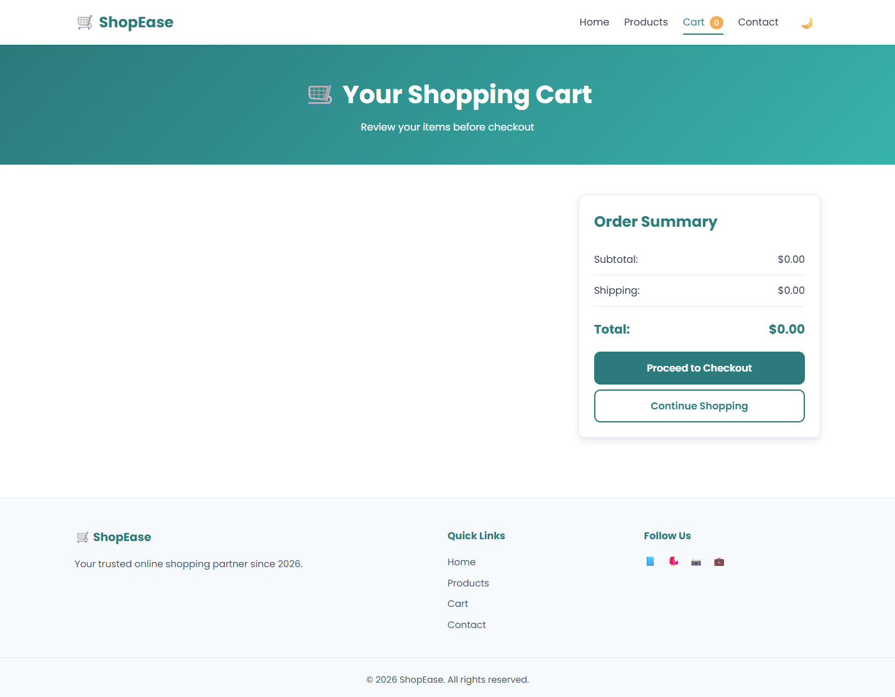
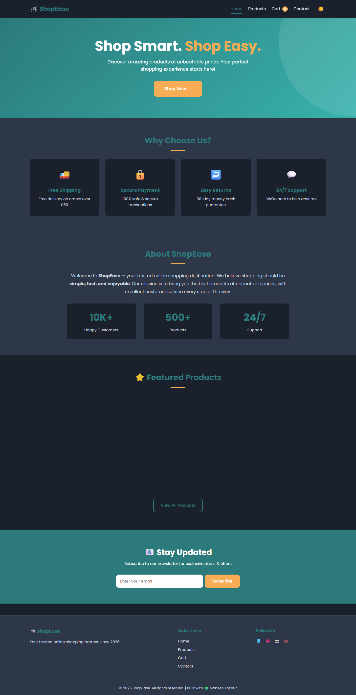
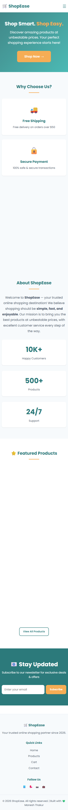

# 🛒 ShopEase — Capstone E-Commerce Web App


> 🚀 A fully responsive, feature-rich e-commerce web application built as the **Final Capstone Project (Task 5)** during my internship at **ApexPlanet Software Pvt Ltd**.

---

## 📖 Table of Contents
- [Overview](#-overview)
- [Features](#-features)
- [Tech Stack](#%EF%B8%8F-tech-stack)
- [Screenshots](#-screenshots)
- [Installation](#%EF%B8%8F-installation)
- [Project Structure](#-project-structure)
- [Key Learnings](#-key-learnings)
- [Author](#-author)

---

## 🎯 Overview
**ShopEase** is a modern, fully functional e-commerce front-end that brings together everything I've learned during my internship — HTML5, CSS3, and JavaScript (ES6+). Built with performance, responsiveness, and user experience in mind.

---

## ✨ Features

### 🛍️ Shopping Features
- Dynamic product listing with 12+ products
- Advanced search functionality
- Category filtering (Electronics, Fashion, Home, Books)
- Sort by price & name
- Product quick-view modal
- Shopping cart with localStorage
- Quantity controls & remove items
- Order summary with shipping calculation
- Checkout modal with form validation

### ❤️ User Experience
- Wishlist / Favorites feature
- Dark mode toggle (persists)
- Smooth scroll animations
- Loading spinner
- Back-to-top button
- Toast notifications
- Mobile-friendly hamburger menu
- Responsive on all devices

### 📝 Forms
- Contact form with validation
- Newsletter subscription
- Checkout form

### 🎨 Design
- Modern UI with gradients
- Smooth transitions & hover effects
- Accessible (ARIA labels, focus states)
- SEO-optimized meta tags

---

## 🛠️ Tech Stack

| Technology | Usage |
|-----------|-------|
| **HTML5** | Semantic markup |
| **CSS3** | Styling, Flexbox, Grid, Animations |
| **JavaScript (ES6+)** | Dynamic functionality |
| **LocalStorage API** | Cart & theme persistence |
| **Git & GitHub** | Version control |

---

## 📸 Screenshots

### 🏠 Home Page


### 🛍️ Products Page


### 🛒 Cart Page


### 🌙 Dark Mode


### 📱 Mobile View


---

## ⚙️ Installation

### Clone the repository:
```bash
git clone https://github.com/Thakurji890/shopease-capstone.git

```

# 🛒 ShopEase — Capstone E-Commerce Project

A responsive e-commerce web application built as the **Final Capstone Project (Task 5)** during my internship at **ApexPlanet Software Pvt Ltd**.

## 🚧 Status
🟢 Day 1 — Planning & Setup Complete ✅
🟢 Day 2 — Design Complete ✅
🟢 Day 3 — Core Features and styling complete ✅
🟢 Day 4 — Cart Page and all functionality complete ✅
🟢 Day 5 — Wishlist, Quick View, and more complete ✅
🟢 Day 6 — Added accessibility features ✅
🟢 Day 7 — Added animations, smooth scrolling, and micro-interactions ✅
🟢 Day 8 — Added About page complete ✅

---

### 📁 Project Structure

shop ease-capstone/
├── assets/
│   ├── images/          # Product images
│   └── screenshots/     # Project screenshots
├── css/
│   └── style.css        # Stylesheet
├── js/
│   ├── main.js          # Main application logic
│   └── products.js      # Product data
├── index.html           # Home page
├── products.html        # Products listing
├── cart.html            # Shopping cart
├── contact.html         # Contact page
├── about.html           # About page
└── README.md            # Project documentation

---

### ⭐ If you found this project helpful, please give it a star! ⭐

--- 

More updates coming soon! 🚀